CS50's MobileApp Development with React Native
===
[top]: topOfThePage

| cs50-mobile | Lecture | Branch | img |
| ---: | --- | --- | --- |
|  01 Overview, JavaScript |Lecture  0 | [ 01_Javascript_src ](      https://github.com/alvinng222/cs50m/tree/01_Javascript_src )     | 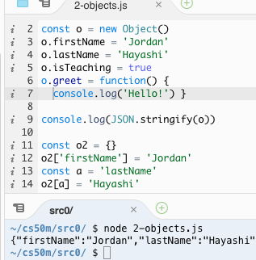 |
|  02 JavaScript, ES6 |     Lecture  1 | [ 02_JS_ES6 ](              https://github.com/alvinng222/cs50m/tree/02_JS_ES6 )             | 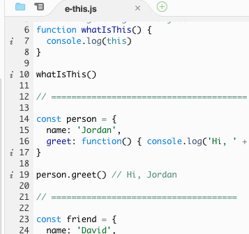 |
|  03 React, Props, State | Lecture  2 | [ 03_ReactPropsState ](     https://github.com/alvinng222/cs50m/tree/03_ReactPropsState )    | 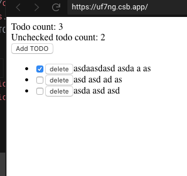 |
|  04 React Native |        Lecture  3 | [ 04_ReactNative ](         https://github.com/alvinng222/cs50m/tree/04_ReactNative )        | 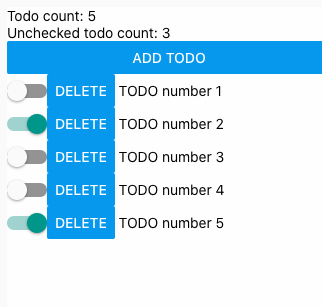 |
|  05 Lists, User Input |   Lecture  4 | [ 05_ListsUserInput ](      https://github.com/alvinng222/cs50m/tree/05_ListsUserInput )     | 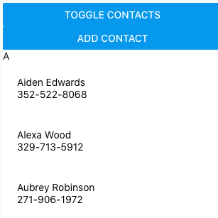 |
|  06 User Input, Debugging|Lecture  5 | [ 06_UserInputDebugging ](  https://github.com/alvinng222/cs50m/tree/06_UserInputDebugging ) | 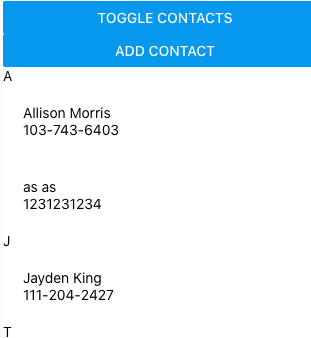 |
|  07 Navigation |          Lecture  6 | [ 07_Navigation ](           https://github.com/alvinng222/cs50m/tree/07_Navigation)         | 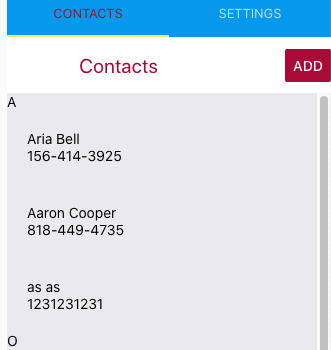 |
|  08 Data |                Lecture  7 | [ 08_Data ](                https://github.com/alvinng222/cs50m/tree/08_Data  )              | 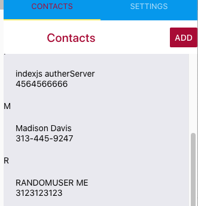 |
|  09 Expo Components |     Lecture  8 | [ 09_ExpoComponents ](      https://github.com/alvinng222/cs50m/tree/09_ExpoComponents )     |  |
|  10 Redux |               Lecture  9 | [ 10_Redux ](               https://github.com/alvinng222/cs50m/tree/10_Redux )              | 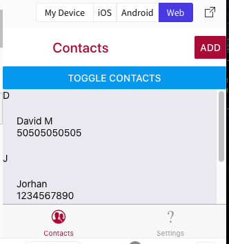 |
|  11 Async Redux, Tools |  Lecture 10 | [ 11_AsyncRedux_Tools ](    https://github.com/alvinng222/cs50m/tree/11_AsyncRedux_Tools )   | 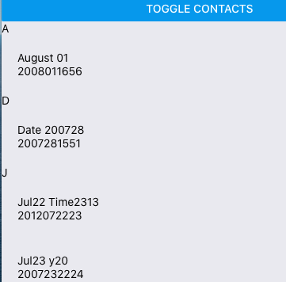 |
|  12 Performance |         Lecture 11 | [ 12_Performance ](         https://github.com/alvinng222/cs50m/tree/12_Performance )        | 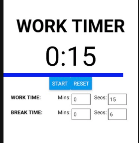 |
|  13 Deploying, Testing |  Lecture 12 | [ 13_Deploying_Testing ](   https://github.com/alvinng222/cs50m/tree/13_Deploying_Testing )  | 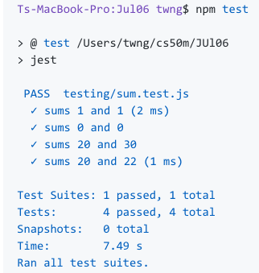 |
|  Exercises 4 Scrolling Views|        | [ exercises-4](             https://github.com/alvinng222/cs50m/tree/exercises-4)            | 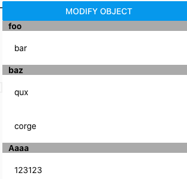 |
|  Exercises 5 Debugging |             | [ exercises-5](             https://github.com/alvinng222/cs50m/tree/exercises-5)            | |
|  Exercises 6 Navigation |            | [ exercises-6](             https://github.com/alvinng222/cs50m/tree/exercises-6)            | 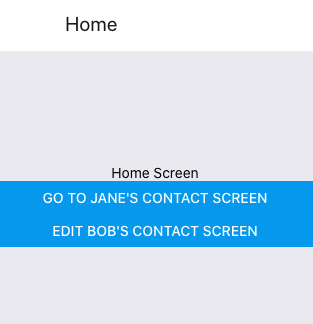 |
|  project 0: TODO App  |              | [ project0 ](               https://github.com/alvinng222/cs50m/tree/project0 )              | |
|  Project 1: Pomodoro Timer  |        | [ project1 ](               https://github.com/alvinng222/cs50m/tree/project1 )              | 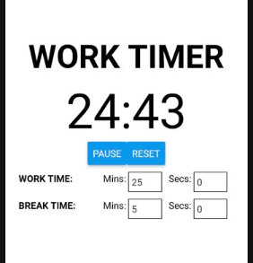 |
|  Project 2: Movie Browser |          | [ project2 ](               https://github.com/alvinng222/cs50m/tree/project2 )              | |
|  Final Project  |                    | [ projectFinal ](           https://github.com/alvinng222/cs50m/tree/projectFinal )          | |

[:top: Top](#top)

---
[**myNote**](mynote.md)

---

